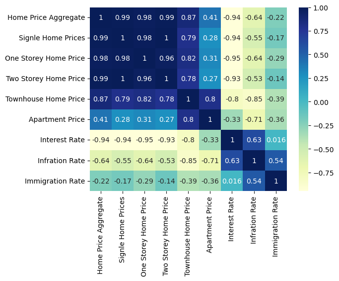
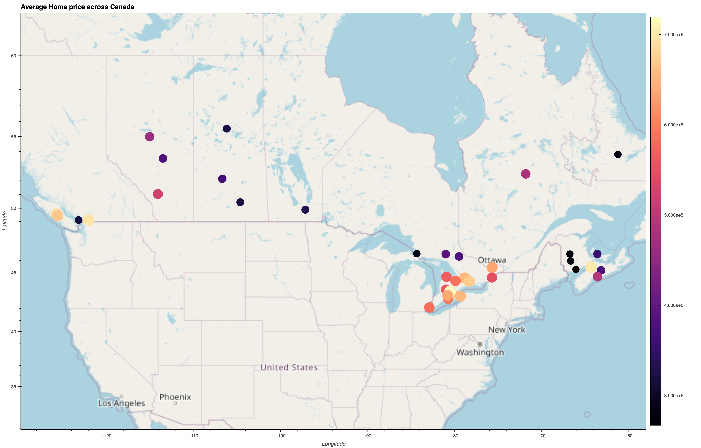
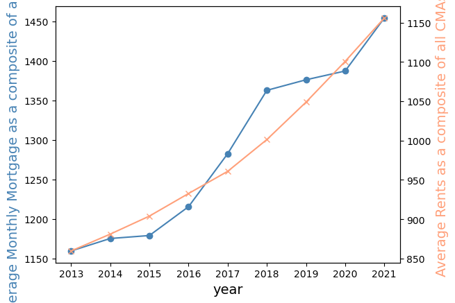
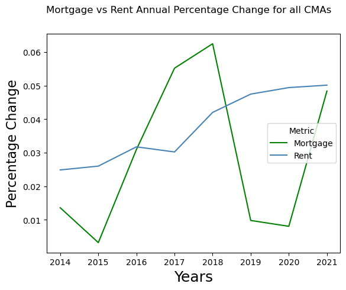
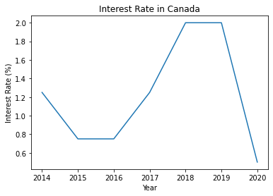
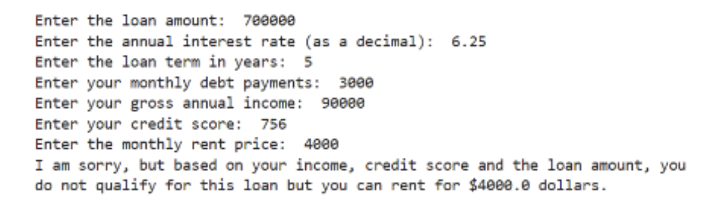
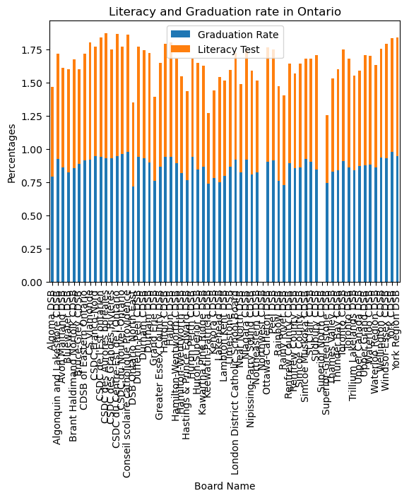
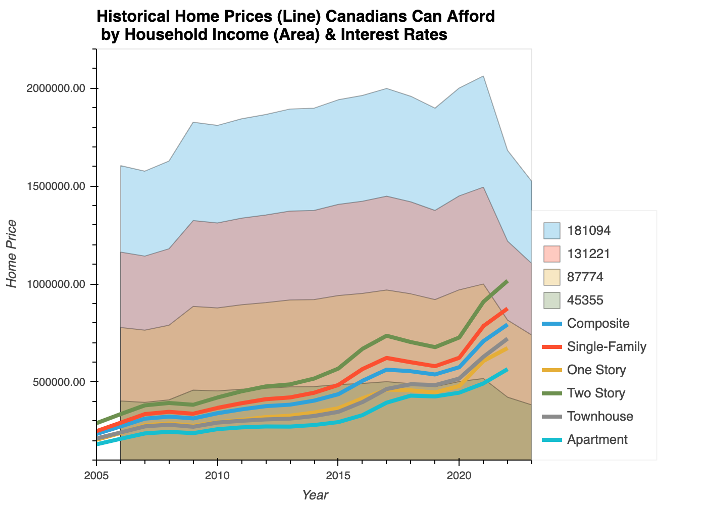

# fintech-project01
UofT Fintech Bootcamp Project01

**Members:** Arun Prasad Krishnan, Juil Yoon, Kei Kasai, Moh Jaiswal, Romain Williams

Project Abstract [[Presentation](https://docs.google.com/presentation/d/e/2PACX-1vQpqhoqND5ZDTo_8uhrVo5SECL_wze3Q7KL7XBq3krg9yFWrBj1Em7eT8ax1O9k5Radiz0f1VdGi9rI/pub?start=false&loop=false&delayms=3000)]

## Code 

**Primary Jupyter Lab Notebook:** [ProjectOne-Grp5.ipynb](ProjectOne-Grp5.ipynb)

Web Render: [NBViewer.org](https://nbviewer.org/github/ft-p1team05/canhomeowner/blob/main/ProjectOne-Grp5.ipynb)

## Data Resources

* [CREA - The Canadian Real Estate Association](https://stats.crea.ca/en-CA/)
  * [Seasonally Adjusted Home Price Index and Benchmark](Resources/Seasonally_Adjusted.xlsx)
* [Bank of Canada](https://www.bankofcanada.ca/rates/)
  * [Interest Rates](https://www.bankofcanada.ca/rates/interest-rates/canadian-interest-rates/)
  * [Inflation](https://www.bankofcanada.ca/rates/indicators/capacity-and-inflation-pressures/inflation/)
* [Statistics Canada](https://www.statcan.gc.ca/en/start)
  * [Immigration](https://www12.statcan.gc.ca/census-recensement/2021/as-sa/fogs-spg/page.cfm?topic=9&lang=E&dguid=2021A000011124)
* [CMHC - Canada Mortgage and Housing Corporation](https://www.cmhc-schl.gc.ca/en/professionals/housing-markets-data-and-research)
  * [Rental Market Data](https://www.cmhc-schl.gc.ca/en/professionals/housing-markets-data-and-research/housing-data/data-tables/rental-market)
  * [Mortgage Data](https://www.cmhc-schl.gc.ca/en/professionals/housing-markets-data-and-research/housing-data/residential-mortgage-industry-data-dashboard)
* [data.ontario.ca](https://data.ontario.ca/) 
  * [Ontario Public School Enrollment](https://data.ontario.ca/dataset/ontario-public-schools-enrolment)

## Research Questions
  - How do financial and demographic variables influence an individual's choice making between renting and buying real estate?
     - Can I afford to buy vs rent based on my household income?
     - Can I afford detached house vs. townhouse/condo/coop in x province?[Kei]
     - Do I match the average income of the province? 
     - Is this the best province I can afford based on my income? 
        - School ranking (Arun)
        - Crime Rate (?)
        - Walkability (?)
     - Will I be able to afford if the interest rate increases? [Romain]
     - What is the difference between investing in home vs. renting & investing difference in stock market? [Moh]
     - What is the average real estate purchase price for each age group afford? [Juil]
     
### What economic factors affect home prices?
*Kei*

We investigated the correlations of home prices across Canada with the interest rate, inflation rate, and immigration rate. We used ten-year historic data from 2014 to 2021.  *Visualization tool:  Seaborn heatmap.*

By observing heatmap, the Canadian home prices are negatively correlated with the interest rate, and the inflation rate, and immigration rate. However, we should consider other factors such as economic growth, unemployment rate, population growth, and also regional factors.

We also investigated an affordability of houses across Canada. Data is based in December 2022. We plot using HvPlot to  show the map and each circle represents average home prices. By sliding your affordable price, it will plots any home prices and below.

The house average price across Canada was between $260,000 and $1.3 million. 

### Should you finance or rent?
*Moh*

Average Mortgage Monthly Payments and Gross Rent

Average Mortgage Monthly Payments (pct_change) and  Gross Rent (pct_change)

### Will I be able to afford if the interest rate increases?

While interest rate is one determinant, how much you can one afford to spend on a home in Canada is primarily determined by how much you can borrow from a mortgage provider. Which simply means that unless you have enough cash to purchase a property outright, you will need to source the funds for an external party. 

The calculator can estimates your living expenses.

With these numbers, you’ll be able to calculate how much you can afford to borrow. You can also change your amortization period and mortgage rate to see how that would affect your mortgage affordability and your monthly payments.

### How big of a factor is school quality?

Other than size and price the investors factors real estates based on schools.

**HOW ARE SCHOOLS DETERMINED?**

1. Schools are determined based on Rankings. 
2. Ranking happens based on Graduation rate, Literacy rate, School Demographics (ethnicity and socioeconomic status of students, teacher qualifications, class size, and graduation rates.) and activities available after school hours.
3. The investors who don’t have school aged kids in their family, still look for properties located near school zones which is because, it will help in increasing the resale value in the future.
4. There are 83 School Boards in Ontario which has 4024 elementary school & intermediate schools and there are 902 secondary schools. The data provided also gives the number of schools present in each regions in province which helps in narrowing down the region you would like to invest/rent.

### How affordable is Canadian real estate based on income?

At a given income level, what home price are Canadians able to afford?

There is a clear trend of home prices crossing outside of lower income bracket affordability.

## Challenges

Getting historical and clean real estate data.

Merging everyone’s code into the same notebook.

Visualizing actionable results.

## Links

Github Repo: 
[https://github.com/ft-p1team05/canhomeowner](https://github.com/ft-p1team05/canhomeowner)

GeoPy:
[https://geopy.readthedocs.io/en/stable/](https://geopy.readthedocs.io/en/stable/)